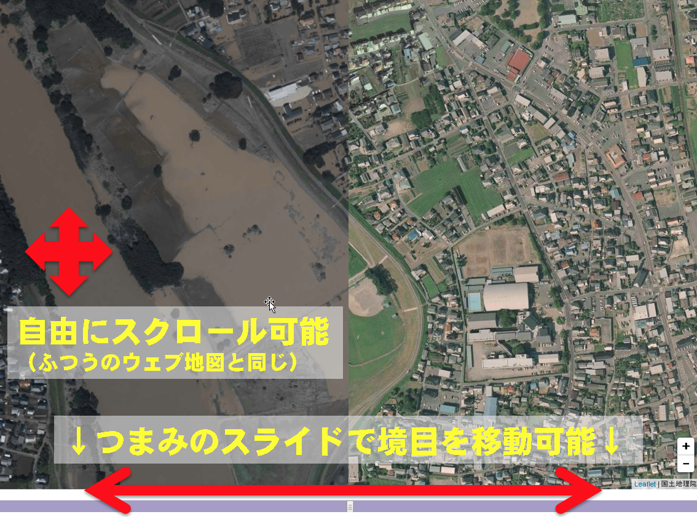

# cmp: オルソ画像の比較
## ページ一覧

- [常総地区](http://gsi-cyberjapan.github.io/cmp/joso.html)
- [大崎地区](http://gsi-cyberjapan.github.io/cmp/ohsaki.html)
  - [大崎地区渋井川](http://gsi-cyberjapan.github.io/cmp/shibui.html)
  - [大崎地区吉田川](http://gsi-cyberjapan.github.io/cmp/yoshida.html)
- [鹿沼地区](http://gsi-cyberjapan.github.io/cmp/kanuma.html)
- [結城地区](http://gsi-cyberjapan.github.io/cmp/yuki.html)

## 操作説明

## 運用担当者向け運用指針
1. index.htmlがベースです。
2. index.htmlにURLパラメータをつけることで各種設定で地図が開きます。
3. index.htmlのURLパラメータは下記の通りです。
  - rl：右側の地図。地理院地図サーバにアップされているlayers.txtに記載されたidで指定（未公開のデータは指定できない）。画像タイルに対応。必須。
  - ll：左側の地図。地理院地図サーバにアップされているlayers.txtに記載されたidで指定（未公開のデータは指定できない）。画像タイルに対応。必須。
  - ovl：追加する情報。地理院地図サーバにアップされているlayers.txtに記載されたidで指定（未公開のデータは指定できない）。画像タイル、ベクトルタイルに対応。複数指定可能(","区切り)。任意。
  - lat：初期表示の緯度。必須。
  - lng：初期表示の経度。必須。
  - z：初期表示のズームレベル。必須。
  - rattr：右側の地図の説明。任意。
  - lattr：左側の地図の説明。任意。
    - URL例：
    - http://gsi-cyberjapan.github.io/cmp/?rl=std&ll=ort&ovl=experimental_anno,experimental_railcl&lat=35.6993&lng=139.9873&z=16&rattr=標準地図&lattr=電子地形図(オルソ)
    - ※rattr、lattrが日本語の場合は、URLエンコードするとよいかもしれません。
4. 各地区のhtmlは、index.htmlへのリダイレクトを記載する形です。
